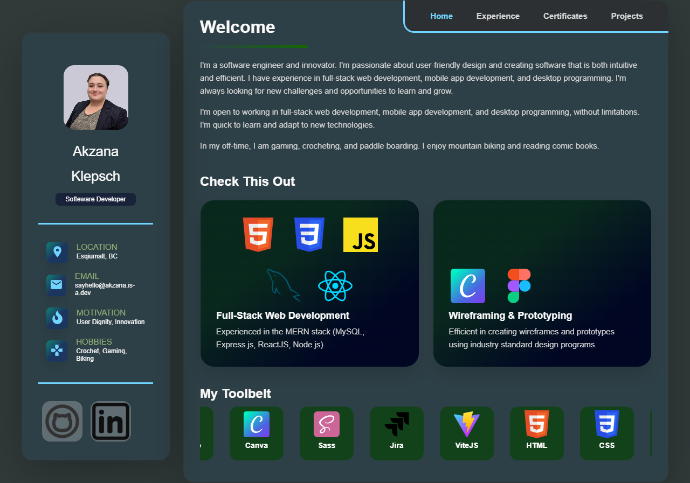

<h1 align="left" id="title">Portfolio Website</h1>
<br>
<p id="description">I redesigned a react app I found and forked.</p>


<br>


<br><br>
<h2>🛠️ Installation Steps:</h2>
<br>


```
git clone https://github.com/<your-username>/dev-portfolio.git
cd dev-portfolio
npm i
npm start
```
<br>

You can easily adapt it to your own site by editing the data files in the **/src/Data** path.

<br>


<h2>🛠 Publish Steps:</h2>
<br>

while in the project's main directory

```
rm -rf .git
git init
git add .
git commit -m "first commit"
git branch -M master
git remote add origin https://github.com/<your-username>/<your-repo>.git
git push -u origin master
```
<br>

In the **package.json** file, update the **homepage** field to: 

```
https://<your-username>.github.io/<your-repo>
```

<br>

```
npm install --save gh-pages
npm run deploy
```
